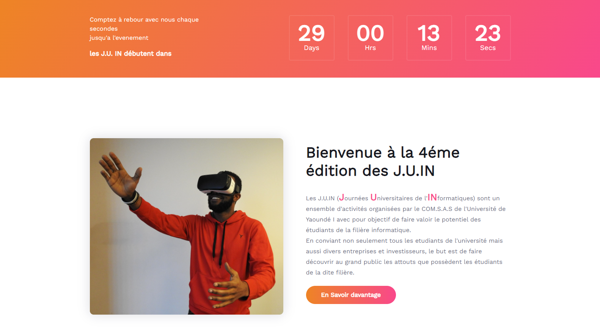

# <b>University Days of Computer Science</b></b>
## <b>Overview</b>
This repository aims at building a website for the University Days of Computer Science. This is for a proper management (like information backup) for the current and future editions of the Computer Science Association (COM.S.AS) and an online presence to enable real-time statiscs and communication of the different events that will be done to students.
 

## <b>Project setup</b>
1. Clone the repositiory into your workstation (device/machine) by running the command:  

        git clone https://github.com/COMSAS-UY1/comsas-juin.git

2. Place yourself at the root of the project.  
   
    `Windows`
        C:\Users\...\comsas-juin

    `Linux`
        /home/.../comsas-juin

### Before executing the following commands, always make sure you are at the root of the project.

3. Setup the virtual environment for the project at its root by running the following commands:  
    

        How to install virtualenv:

### Install **pip** first

    sudo apt-get install python3-pip

### Then install **virtualenv** using pip3

    sudo pip3 install virtualenv 

### Now create a virtual environment 

    virtualenv venv 

>you can use any name insted of **venv**
   
    `Activation on Windows`
    
        3. .\venv\Scripts\activate
   
    `Activation on Linux/MacOS`
    
        3. source venv/bin/activate

    To deactivate the already activated virtual environment, simply type `deactivate` in the terminal, if not run the following command:  

    `Deactivation on Windows`

        .\venv\Scripts\deactivate

    `Deactivation on Linux/MacOS`

        deactivate

4. Inside the created and activated virtual environment, `Install` the required packages from [requirements.txt](./requirements.txt) by running the command:  

        pip install -r requirements.txt

## <b>Launching of the project</b>

### Before executing the following commands, always make sure you are at the root of the project.

5. Migrate the data to the database (`Sqllite` by default):  

        python manage.py migrate

6. Run the project using the command:  

        python manage.py runserver

7. Check the server is running by going to [localhost:8000](http://127.0.0.1:8000)
